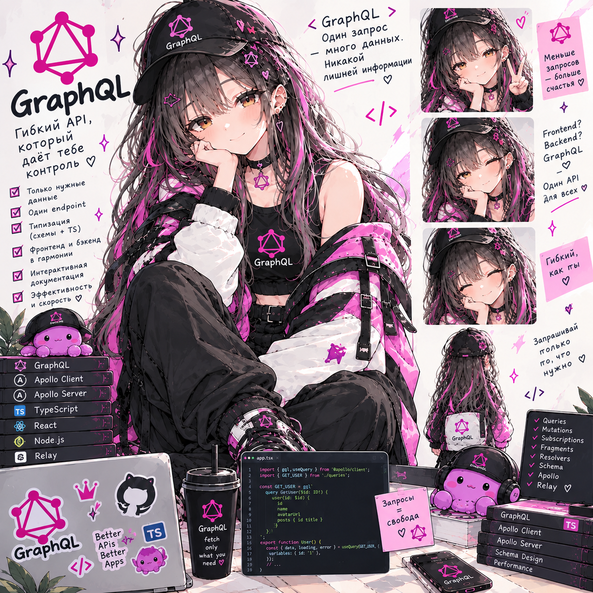

# GraphQL Lab — CineGraph

**Статус: ⚪ методичка готова, прохождение впереди.**
**Сложность: высокая.** Проект полностью самостоятельный (свой репозиторий `graphql-lab`), ни от одной другой лабы не зависит — домен другой (каталог фильмов, а не Helpdesk). Из знаний пригодятся основы NestJS (модули, DI, декораторы) и TypeScript на уровне «классы, интерфейсы, async/await» — всё остальное объясняется по ходу.

## О чём

CineGraph — каталог фильмов, режиссёров и рецензий, спроектированный так, чтобы естественно упереться во все ключевые темы GraphQL: язык запросов и жизненный цикл запроса (parse → validate → execute), N+1 в резолверах и `DataLoader`, JWT и права на уровне полей (а не только на операции), интерфейсы и юнионы (фильмография смешивает роли, поиск — фильмы и людей), курсорная пагинация рецензий (Relay Connection), подписки на живую ленту через Redis (и что происходит, если запустить два инстанса), защита от тяжёлых запросов (depth limit + query complexity).

## Стек

NestJS + `@nestjs/graphql` + Apollo Server (code-first: `@ObjectType`/`@Field`/`@Resolver`), Prisma 7 + `@prisma/adapter-pg` + PostgreSQL 17, `dataloader` для батчинга, `@nestjs/jwt` + bcryptjs, `graphql-subscriptions`/`graphql-redis-subscriptions` + Redis для подписок, `graphql-query-complexity`. Всё в Docker.

## Формат

Методичка [`GraphQL_Lab_Plan.html`](GraphQL_Lab_Plan.html) — открывается в браузере, прогресс по чекбоксам сохраняется локально.

## Что внутри (3 сессии)

- **Сессия 1** — инфраструктура и схема: репозиторий и NestJS, docker-compose (Postgres + Redis), модель данных и seed, первые `ObjectType`/`Query`, связи через резолверы полей (наивно), воспроизводим и считаем N+1, input-типы и переменные
- **Сессия 2** — DataLoader, мутации, ошибки, права, полиморфизм: DataLoader на каждый запрос, вычисляемые поля из чужого модуля, JWT-мутации (регистрация/вход), мутации рецензий с guard и владением, формат ошибок и маскировка, права на уровне полей и ролей, интерфейсы и юнионы, курсорная пагинация
- **Сессия 3** — подписки, Redis, защита, тесты: живая лента рецензий, два инстанса и Redis Pub/Sub, клиент без библиотек (`fetch` + `graphql-ws`), depth limit и query complexity, unit- и e2e-тесты, "Production Hell" — финальный сценарий без подсказок

Разделы 1–8 методички — теория (типичные заблуждения о GraphQL, как GraphQL устроен внутри, итоговая архитектура, стек и структура, N+1 и DataLoader, сценарий жизни одной рецензии, ошибки и nullability, пагинация/безопасность/кэш), раздел 9 — три сессии заданий, разделы 10–13 — чек-лист, глоссарий, вопросы для собеседования, что дальше.

---

Часть сборного репозитория лабораторных работ — [submodule-group-lab](https://github.com/meeymirita/submodule-group-lab).
